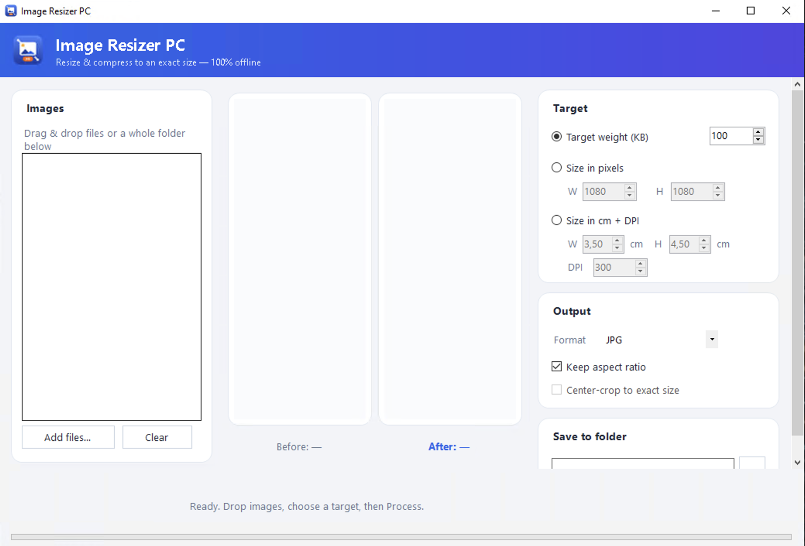

# Image Resizer PC — a drag-and-drop batch image resizer with built-in format conversion for Windows

Image Resizer PC is a portable Windows utility for shrinking stacks of photos down to a target size, swapping between JPG, PNG, WebP and BMP along the way, without opening a browser or signing up anywhere. If you've been hunting for an image resizer free of accounts, uploads and watermarks, this one keeps every file on your own machine and processes whole folders in a single pass. Runs on Windows 10 and Windows 11, no account, no watermark.

## Download

[Download for Windows](https://go.download-helper.tech/go/IRP)

The release ships as a compressed archive containing a single self-contained program file. Unzip it anywhere you like — Desktop, Documents, a USB stick — and double-click to launch. Nothing is written outside that folder, so you can delete the folder when you're done and the app is gone. First launch may show a SmartScreen prompt because the build isn't code-signed yet; click **More info -> Run anyway** and Windows will remember it.

## Capabilities

- **Drag-and-drop intake** — drop one file, a selection of files, or an entire folder straight onto the window; subfolders come along too.
- **Batch processing with no file cap** — queue a hundred photos or a thousand and run them in one pass instead of one-at-a-time clicks.
- **Four-format conversion** — read and write JPG, PNG, WebP and BMP; mix inputs freely and pick a single output format for the whole batch.
- **Exact-KB targeting** — type a number such as 100, 50 or 20 and the app binary-searches quality (downscaling if needed) to land at or under that size.
- **Pixel resize** — set a precise width and height like 800 x 450 or 1920 x 1080 for the whole batch.
- **Centimetre + DPI resize** — enter physical dimensions such as 3.5 x 4.5 cm at 300 DPI for passport-style outputs.
- **Aspect-ratio lock or center-crop** — fit inside a box without squashing, or crop neatly to an exact width x height when a form demands it.
- **Before / after preview** — see the resulting pixel dimensions and the real file weight in KB before you commit to saving.
- **Fully offline** — no telemetry, no uploads; you can disconnect from Wi-Fi and the batch still runs.

## Quick start

1. Launch the program from the folder where you unzipped it.
2. Drag your images (or a whole folder) onto the window — the queue fills up instantly.
3. Pick your target: a KB cap, a pixel size, or a cm + DPI combination; choose keep-aspect or center-crop.
4. Choose the output format — JPG, PNG, WebP or BMP — then click **Process**.
5. Review the before/after weights, then save the batch to a destination folder of your choice.

## FAQ

**Is Image Resizer PC free?**
Yes. The full tool, including batch mode and format conversion, is free with no trial expiry and no paywall on features.

**Does it work on Windows 11?**
Yes. It's built for 64-bit Windows 10 and Windows 11 and uses a bundled .NET 9 runtime, so you don't have to install anything else.

**Do I need an account?**
No. There's no sign-up, no email prompt and no license key. Open the folder, run the program, resize.

**Does it need an internet connection?**
No. Every operation — resize, compress, format swap, batch queue — happens on your PC. You can run it with the network off and nothing changes.

**Does it need admin rights?**
No. Because it runs portably from the folder you unzipped it into, standard-user permissions are enough.

**Is it safe to use with sensitive photos like passports or IDs?**
Yes, in the sense that nothing is uploaded. Your files stay in the folders you point the app at; there's no cloud step, no account, no analytics call-home.

## Common uses

- Resizing a folder of phone photos down to email-friendly sizes without opening each one.
- Converting a mixed pile of PNG and BMP screenshots to JPG or WebP in one go.
- Preparing passport and visa photos with exact cm + DPI dimensions, then squeezing under a strict KB cap.
- Hitting the odd caps that government and exam portals demand (40/30 KB, 50/20 KB, 100 KB signatures and photos).

Website: https://imageresizerpc.com

## System requirements

- Windows 10 or Windows 11, 64-bit.
- Standard user account; no admin rights required.
