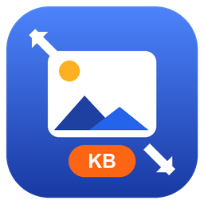

# Image Resizer PC

**Resize and compress any image to an exact file size in KB — 100% offline, right on your PC. Built for passport & visa photos and government / exam portal uploads with strict KB caps.**

  

 

-2563EB)

---

Online portals keep capping uploads at **100 KB**, **50 KB**, or even **20 KB** — and most tools that hit those numbers want you to upload your passport, signature, or ID to their servers first. **Image Resizer PC** does the opposite: you type the target size you need, it automatically finds the best quality that lands **at or under** that size, and every byte of processing happens **locally on your machine**. No account, no upload, no watermark, no file-count limit.

## Features

| | |
|---|---|
| **Target an exact KB size** | Type a number (e.g. 100 / 50 / 20 KB). The app runs a binary search over quality — and downscales when needed — to land at or under your target. |
| **Resize by pixels or by cm + DPI** | Set width/height in pixels, or physical size in centimetres at a chosen DPI (e.g. 3.5 × 4.5 cm @ 300 DPI → a passport-sized image). |
| **Keep aspect ratio or center-crop** | Fit within a box, or crop to an exact box (e.g. 500 × 500). |
| **Batch a whole folder** | Drag & drop individual files *or* entire folders and process them in one go. |
| **Formats** | JPG, PNG, WebP, BMP. |
| **Before / after preview** | See the resulting dimensions *and* file weight before you save. |
| **Dead-simple UI** | Drag → pick a target → **Process**. That's the whole flow. |

> Honest note on quality: at aggressive KB targets some visible compression is unavoidable — the app always gives you the **best quality that fits the target size**, not magic lossless shrinking.

## Download

**[⬇ Download the latest release](../../releases/latest)** — a single portable `ImageResizerPC.exe`.

- **No installer, no setup.** Unzip and double-click.
- **No pre-installed .NET required** — the runtime is bundled inside this self-contained single-file build.
- **Windows 10 / 11, 64-bit.**

**First-run note (SmartScreen):** the `.exe` is currently unsigned and ships as a compressed single-file self-extractor, so Windows SmartScreen / Defender may show a **"Windows protected your PC"** prompt the first few times until download reputation builds up. To run it: click **More info → Run anyway**. This disappears over time (and permanently once the build is code-signed).

## How to use

1. **Drag & drop** an image, several images, or a whole folder onto the window.
2. **Pick your target:**
   - a **file size in KB** (e.g. `50`), and/or
   - a **pixel** size (e.g. `800 × 450`), and/or
   - a **physical** size in **cm + DPI** (e.g. `3.5 × 4.5 @ 300`).
   - Choose **keep aspect ratio** or **center-crop to an exact box**.
3. Pick the **output format** (JPG / PNG / WebP / BMP).
4. Click **Process**. Check the **before/after** weight, and save.

## Common uses

- **Passport & visa photos** — exact cm + DPI sizing, then squeezed under a KB cap.
- **Government & exam-registration portals** with hard upload limits — e.g. photo/signature caps around **40 / 30 KB**, **50 / 20 KB**, **50 / 30 KB**. Dial in the exact number the form demands.
- **Job applications & online forms** that reject anything over a set size.
- **Batch shrinking** a folder of photos to email, archive, or post without the bulk.

## Keyword-friendly FAQ

**How do I resize an image to 100 KB?**
Drop the image in, set the target to `100` KB, and click Process. The app auto-adjusts quality (and downscales if needed) so the output is at or under 100 KB, then shows you the exact resulting weight.

**How do I resize an image to 50 KB?**
Same flow — set the target to `50` KB. Handy for the many bank and exam portals that cap photos at 50 KB.

**How do I resize an image to 20 KB?**
Set the target to `20` KB. For very small targets (common for signatures), the app will reduce quality and, if necessary, downscale dimensions to meet the cap while keeping the result as clean as the size allows.

**How do I compress a photo for a passport or visa upload?**
Set the physical size (e.g. `3.5 × 4.5 cm @ 300 DPI`) or crop to the required pixel box, then set the KB target your portal asks for. Because everything runs locally, your ID photo never leaves your computer.

**Does it work offline?**
Yes — completely. There's no upload, no sign-in, and no internet connection required at any point.

## Privacy

- **Nothing is uploaded.** All resizing and compression happen on your own PC.
- **No account, no login.**
- **No telemetry, no tracking, no ads.**

Your sensitive documents — passports, signatures, IDs — stay on your machine.

---

**Image Resizer PC** · free & portable · Windows 10/11 64-bit · [imageresizerpc.com](https://imageresizerpc.com) · Automatic quality for the target size — honest compression, no false "lossless" promises.